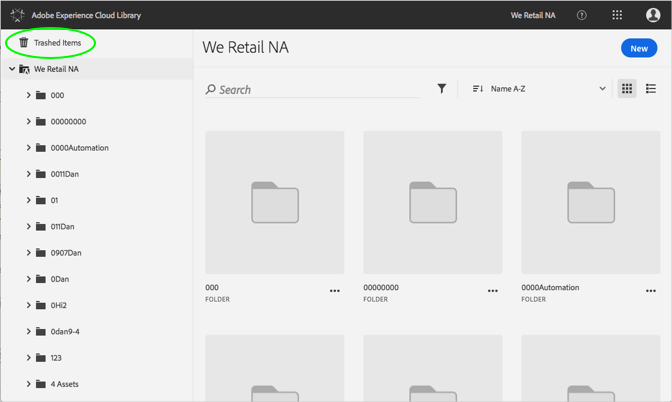
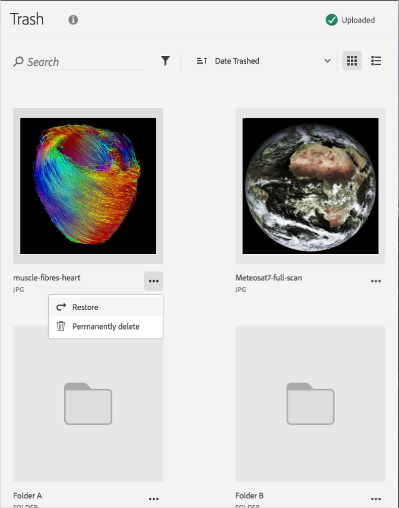

# 永久删除垃圾资产{#permanently-delete-a-trashed-asset}

您可以永久删除Adobe Experience Cloud Library中的已废弃资产。

当您垃圾桶时，它将在Experience Cloud Library中的“废物品”区域存放60天。如果不恢复项目，Experience Cloud Library将在60天后永久删除它们。

您可以通过以下方式永久删除已删除的资产：

1. 单击 **[!UICONTROL “已跳转项目]**”。

   

1. 单击一个或多个项目以永久删除。
1. 单击 **[!UICONTROL “更多信息”&gt;“永久删除]**”。

   

1. 确认您要永久删除选定的资产。

