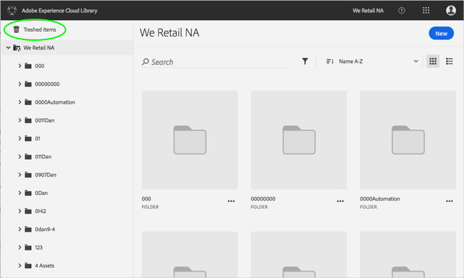
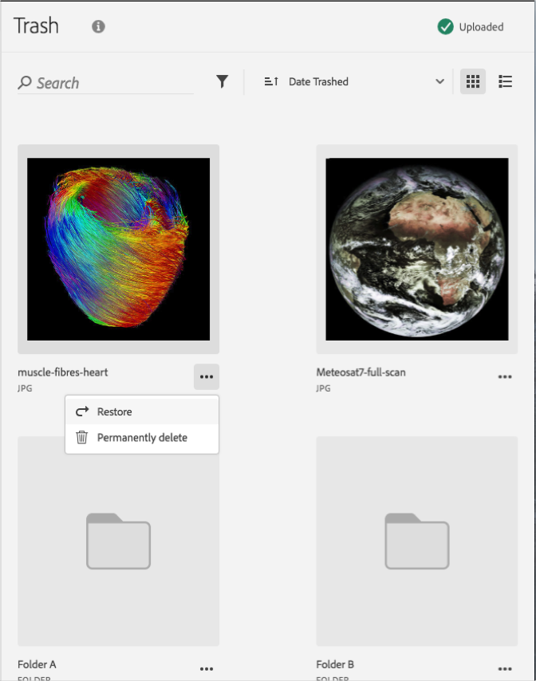

# 恢复置入垃圾桶的资产{#restore-a-trashed-asset}

您可以恢复 Adobe Experience Cloud 库中置入垃圾桶的资产。

当您将项目置入垃圾桶后，该项目可以在 Experience Cloud 库中的“垃圾项目”区域存留 60 天。如果不恢复这些项目，Experience Cloud 库将在 60 天后永久删除它们。

要在 60 天内恢复置入垃圾桶的资产，请执行以下操作：

1. 单击&#x200B;**[!UICONTROL 垃圾项目]**。

   

1. 单击一个或多个要恢复的项目。
1. 单击&#x200B;**[!UICONTROL 更多信息 &gt; 恢复]**。

   

1. 确认您要恢复选定的资产。

确认已恢复资产的信息将会显示在顶部。
