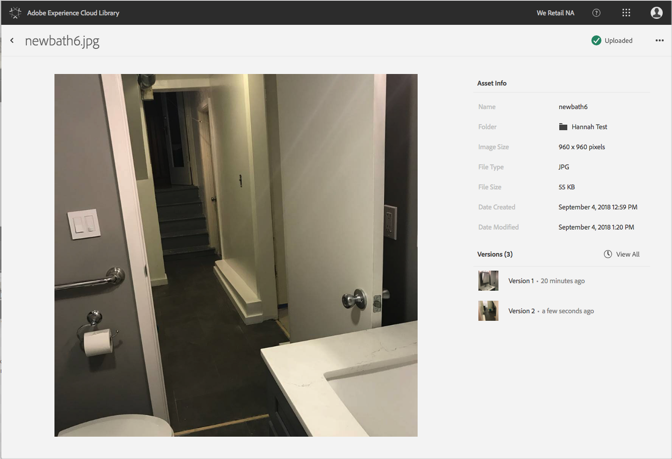

# 查看资产的详细信息{#view-detailed-information-for-an-asset}

在 Adobe Experience Cloud 库中查看有关资产（包括版本）的详细信息。

要在 Experience Cloud 库中查看有关资产（包括版本）的详细信息，请执行以下操作：

1. 单击资产。
1. 单击资产旁边的&#x200B;**[!UICONTROL 更多选项]**&#x200B;菜单（省略号）。

   

1. 单击&#x200B;**[!UICONTROL 查看详细信息]**，即可查看相关资产的更多详细信息。

   

