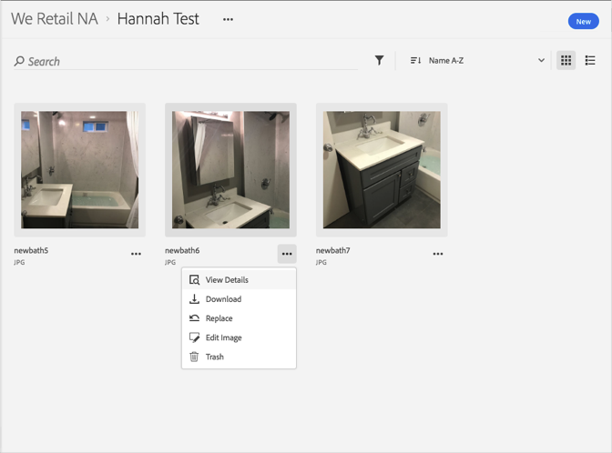

# 查看资产的详细信息{#view-detailed-information-for-an-asset}

在Adobe Experience Cloud Library中查看有关资产(包括版本)的详细信息。

要查看有关资产(包括版本)在Experience Cloud Library中的详细信息，请执行以下操作：

1. 单击资产。
1. 单击资产旁边的 **[!UICONTROL “更多选项]** ”菜单(省略号)。

   

1. 单击 **[!UICONTROL 查看详细信息]** 可查看资产的更多详细信息。

   

