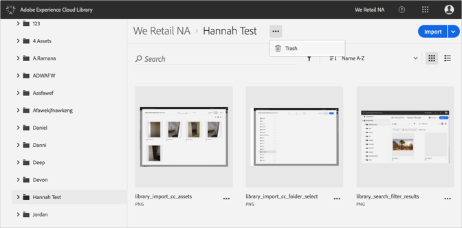
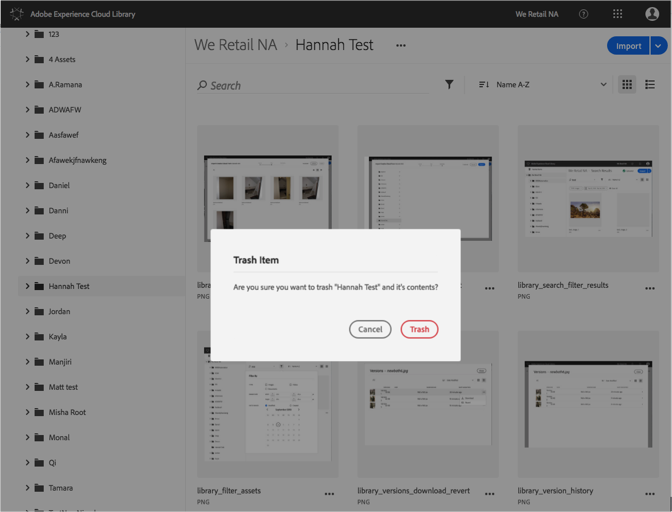

# 回收文件夹{#trash-a-folder}

您可以在Adobe Experience Cloud Library中回收文件夹。

要在Experience Cloud Library中删除文件夹，请执行以下操作：

1. 单击文件夹以垃圾桶。
1. 单击 **[!UICONTROL “更多选项菜单]** (省略号)”，然后选择 **[!UICONTROL “回收站]**”。

   

1. 确认要删除该文件夹。

   

