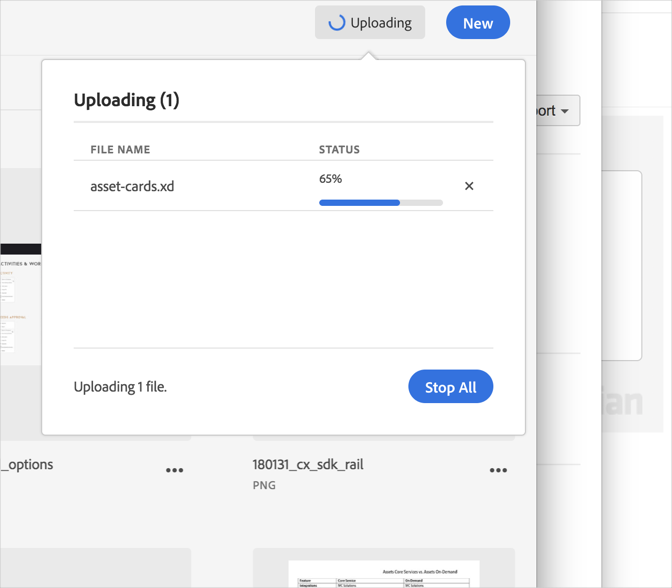

# 取消上传{#cancel-an-upload}

如果选择了不正确或过大的文件，可取消由设备向 Adobe Experience Cloud 库的文件上传。

要取消已经开始的上传，请执行以下操作：

1. 单击通知指示器。
1. 单击&#x200B;**[!UICONTROL 全部停止]**&#x200B;可停止所有上传和下载活动，或者单击位于要取消的个别文件旁边的 **[!UICONTROL X]**。

   

如果选择了一个或多个同名文件，Experience Cloud 库会提示您替换旧版本或保留新版本。
