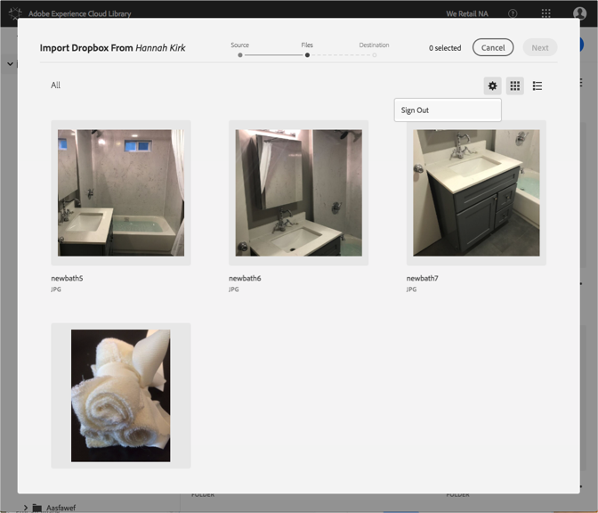

# 更改 Dropbox 或 Creative Cloud 帐户{#change-dropbox-or-creative-cloud-accounts}

切换到其他 Dropbox 或 Creative Cloud 帐户，以便向 Adobe Experience Cloud 库中添加内容。

登录到 Dropbox 或 Creative Cloud 帐户后，除非注销或切换帐户，否则您将继续保持登录状态。

要切换到其他 Dropbox 或 Creative Cloud 帐户，请执行以下操作：

1. Select **[!UICONTROL New]** > **[!UICONTROL Import]**.

   

1. 选择 **[!UICONTROL Creative Cloud]** 或 **[!UICONTROL Dropbox]**。

   

1. 选择&#x200B;**[!UICONTROL 下一步]**。
1. 选择右上角的齿轮图标。

   

1. 选择&#x200B;**[!UICONTROL 注销]**。
1. 登录到另一个帐户。

