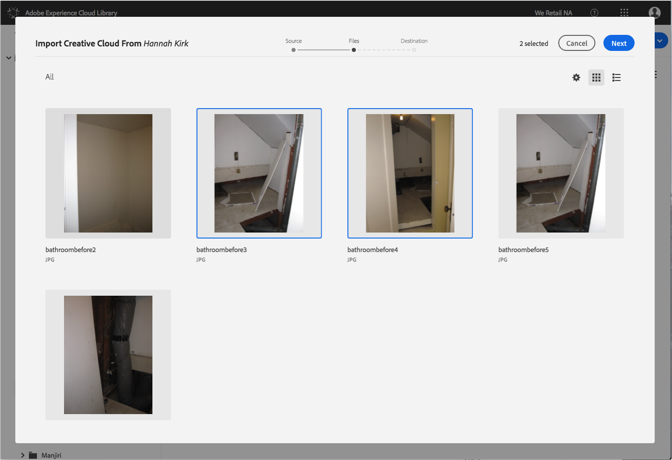

# 将 Creative Cloud 文件导入 Adobe Experience Cloud 库{#import-creative-cloud-files-into-the-adobe-experience-cloud-library}

将文件从 Creative Cloud 导入 Adobe Experience Cloud 库，以便通过任何 Adobe Experience Cloud 产品管理这些文件。

>[!NOTE]
>
>必须先创建文件夹，然后才能执行这项任务。

要将 Creative Cloud 文件导入 Experience Cloud 库，请执行以下操作：

1. 选择&#x200B;**[!UICONTROL 新建]** &gt; **[!UICONTROL 导入]**。

   

1. 选择 **[!UICONTROL Creative Cloud]**。

   登录到您的 Creative Cloud 帐户（如果尚未登录）。

   

1. 单击&#x200B;**[!UICONTROL 下一步]**。
1. 选择一个或多个要导入的文件。

   

1. 单击&#x200B;**[!UICONTROL 下一步]**。
1. 选择要放置相应资产的文件夹。

   >[!NOTE]
   >
   >您可以选取一个文件夹，以存放导入的资产。要将文件放置在不同的文件夹，请为每个文件夹重复此任务。

   

1. 单击&#x200B;**[!UICONTROL 导入]**。

