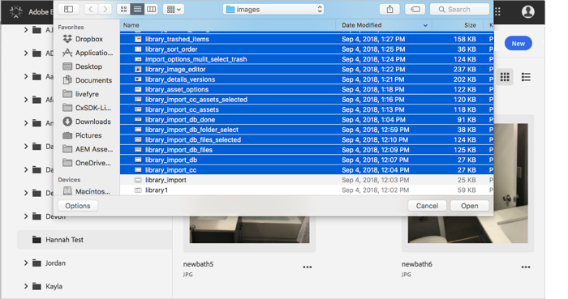
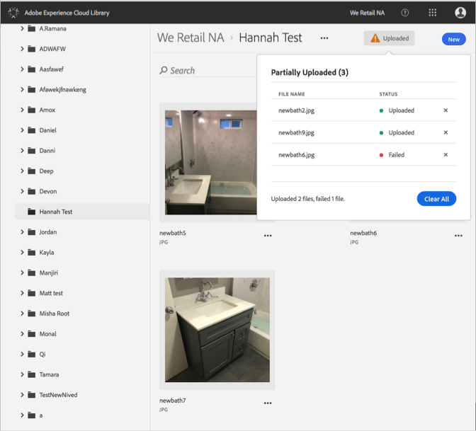

# 从设备上传资产{#upload-asset-from-device}

从设备上传资产，以便在 Adobe Experience Cloud 库中管理资产。

要将资产从设备上传到 Experience Cloud 库，请执行以下操作：

1. Select **[!UICONTROL New]** > **[!UICONTROL Upload]**.

   

1. 选择要上传到 Experience Cloud 库的资产。

   

1. 当您的文件上传结束后，通知框中会显示确认消息或任何错误消息。

   

